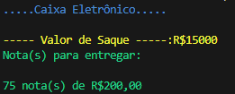

# Caixa Eletrônico
Software sobre exercício de Projeto Final (Caixa Eletrônico) 1ML3 de informática ETEC Adolpho Berezin.
 
Programa consiste em realizar um saque em um caixa eletrônico que calcula a quantidade de notas a entregar ao solicitante dado um valor desejado para saque (o número deve ser positivo e não pode conter centavos), calcule a quantidade de cada nota a ser entregue. Dê preferência para notas de valor mais alto.
 
Notas disponíveis: 1, 2, 5, 10, 20, 50, 100 e 200 reais
 
## Exemplo
 
```
.....Caixa Eletrônico.....
 
----- Valor de Saque -----:R$10
Nota(s) para entregar:
 
1 nota(s) de R$10,00
```
 
## _Screenshot_
 

 
## _Download_
 
Download do arquivo abaixo:
 
[🗃 Download do arquivo .zip](dist/ProgramCX.zip)
 
Para executar, utilize o comando:
 
```
dotnet CaixaEletronico.dll
```
 
Ou, se preferir, pode dar duplo-clique no ícone do programa.
 
## Agradecimentos
 - [Figgle](https://github.com/drewnoakes/figgle)
- [Etec Adolpho Berezin](https://eteab.com.br)
- [Prof. Ermogenes](https://github.com/ermogenes)
- [Prof. Diego Neri](https://github.com/diegoneri)
 

### _Creator_
- [Guilherme de Almeida Silva](https://github.com/Guialmeidasx)


Todos direitos reservados aos criadores®™
